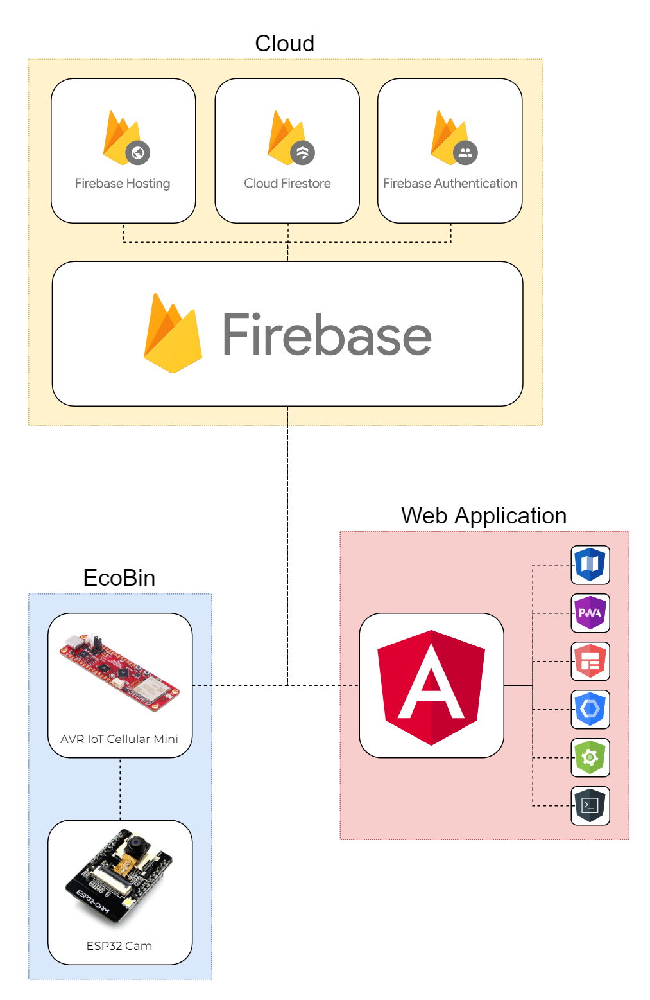

# EcoBin: A Smart Solution for Waste Management and Environmental Sustainability

This project was submitted for the [Future of Resilience Contest](https://www.hackster.io/contests/avriot/hardware_applications/16317). More information on this project can be found [here](https://www.hackster.io/mferuscomelo/ecobin-smart-waste-management-for-a-greener-planet-47c7a6).

According to the World Bank, the world generates 2.01 billion tonnes of municipal solid waste annually, with at least 33% of that not managed in an environmentally safe manner. This improper waste disposal, often as a result of overflowing and unhygienic conventional waste bins, is a major environmental problem that cause pollution, health hazards, and resource depletion. Existing solutions such as smart waste bins or waste sorting robots are expensive, complex, and require frequent maintenance.

EcoBin can also help optimize garbage pickup routes by using the data from the sensors and the app to determine the best time and frequency to collect the waste from each bin. The app can send the data to the waste management authorities, who can use it to plan and schedule the most efficient and eco-friendly routes for the waste trucks. This can reduce the fuel consumption and the emissions of the waste trucks, as well as the labor and the operational costs of waste collection. EcoBin can also alert the authorities if any bin is overflowing or tripping, and prioritize the pickup of those bins. This can improve the cleanliness and the safety of the streets, and prevent the spread of diseases and pests.

My solution would provide a low-cost alternative to expensive smart bins and the opportunity to retrofit existing bins and optimize the garbage pickup routes.

## Credentials

**Admin:** \
Username: `admin@ecobin.com` \
Password: `admin1234`

**User:** \
Username: `user@ecobin.com` \
Password: `user1234`

## The Story

### Sensor Comparison

| Specifications      | [HC-SR04](/datasheets/HC-SR04.pdf) | [VL53L5CX](/datasheets/VL53L5CX.pdf) | [TMF8821](/datasheets/TMF8821.pdf) |
| ------------------- | ---------------------------------- | ------------------------------------ | ---------------------------------- |
| Cost                | $17.95                             | $25.50                               | $21.50                             |
| Technology used     | Ultrasonic                         | Time-of-Flight                       | Direct Time-of-Flight              |
| Operating frequency | 40 Hz                              | < 60 Hz                              | < 30 Hz                            |
| Operating voltage   | 3.3 V                              | 3.3 V                                | 3.3 V                              |
| LP idle current     | --                                 | 45 µA                                | 2 µA                               |
| HP idle current     | --                                 | 1.3 mA                               | 8 µA                               |
| Active current      | 15 mA                              | 45 mA                                | 57 mA                              |
| Field of view       | < 15°                              | < 63°                                | < 63°                              |
| Accuracy            | ±3mm                               | ± 5%                                 | ± 3%                               |
| Zones               | 1                                  | 4x4, 8x8                             | 3x3, 4x4, 3x6                      |
| Range               | 20mm - 4000mm                      | 2mm - 4000mm                         | 10mm - 5000mm                      |

## Points to describe

### Project Definition and Plan (30 points)

- What problem are you trying to solve, why is it important and how is it relevant to the theme of the competition?
- How are you approaching your project's "impact"? What kind of community/communities can your project affect?
- What is your project innovative or creative aspects.

### Project Hardware Design and Implementation (30 points)

- Include a system architecture to illustrate your overall design.
- Include schematics, PCB design, mechanical drawings, BOM and assembly instructions.
- Show how you created your project, including images, screenshots, and/or a video demonstration of your solution working as intended. (video demos get bonus points)

### Project Software Design and Implementation (30 points)

- Include working code listings (or repository access) with helpful comments.
- Includes any design documentation and approaches to fault tolerance.

### Project Summary (10 Points)

- Document the effectiveness of the solution provided by the project, learnings, or corrections in the implementation of the project along the way.
- Did the project implementation satisfy the Project definition scope?
- How well did the test criteria results meet the expectations?
- What would be done differently or improved?
- Ask yourself: "If I were a beginner reading this project, would I understand how to recreate it?"
