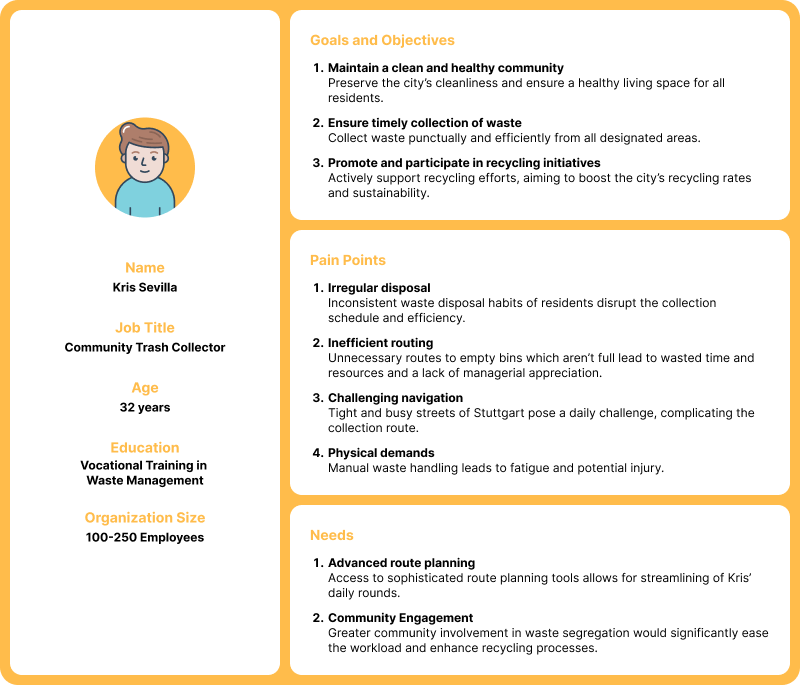
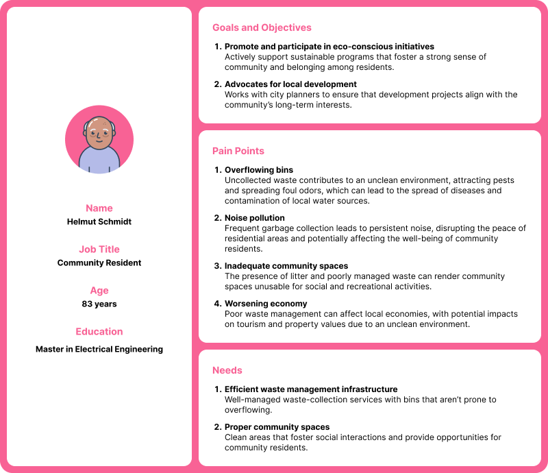
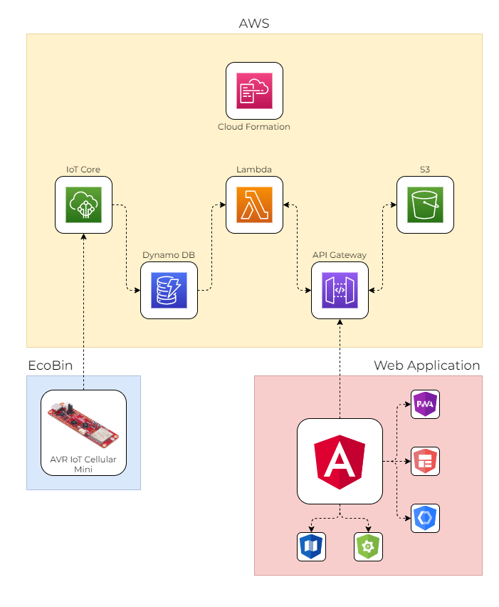
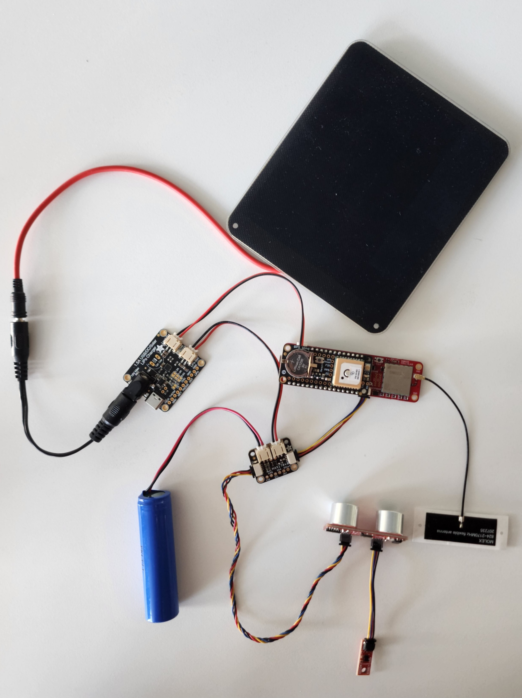
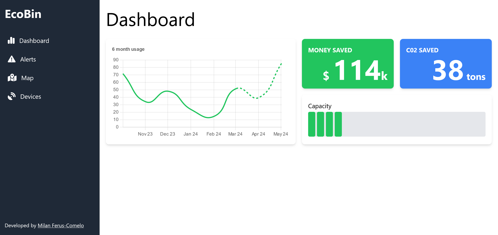
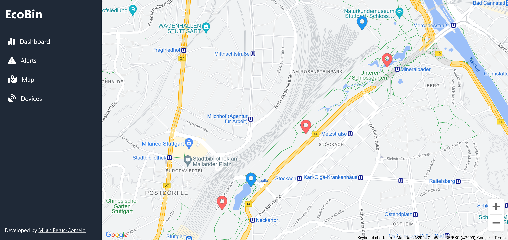

# EcoBin: A Smart Solution for Waste Management and Environmental Sustainability

This project was submitted for the [Future of Resilience Contest](https://www.hackster.io/contests/avriot/hardware_applications/16317).

## Introduction

In a world where the generation of municipal solid waste is escalating to an estimated **2.01 billion tons annually**, with a staggering **33% not managed in an environmentally safe manner** [1], the need for innovative waste management solutions like EcoBin becomes ever more pressing. The repercussions of inadequate waste disposal are far-reaching, leading to pollution, health hazards, and the depletion of resources due to the over-reliance on landfills, which undermine the potential benefits of recycling and reusing materials. Conventional waste bins often contribute to these issues due to overflow and lack of hygiene, with waste management services of big cities like Stuttgart being responsible for maintaining and emptying hundreds of garbage bins every day. Smart waste solutions already exist, though they pose challenges in terms of cost, complexity, and maintenance. Another problem is that these systems are designed from the ground up and cannot be retrofitted to existing bins, raising costs and complexity during installation.

## Personas

To aid in the development of EcoBin, I conducted a comprehensive analysis of three user personas, which are integral to understanding the specific needs and challenges within the waste management sector. These personas are constructed from qualitative and quantitative research within Stuttgart's waste management landscape, providing a framework for my solution's design and implementation. These personas represent the diverse user base that EcoBin aims to serve, ensuring a targeted and effective approach to enhancing urban waste management systems.

### Jessica Shikoba

### Kris Sevilla

### Helmut Schmidt

## The Solution

Using the aforementioned-personas, I was able to analyze their distinct roles and interactions within the waste management system and identify key pain points and areas for improvement. In the end, I decided to focus on Jessica Shikoba since her role as Waste Management Director is pivotal in the decision-making process for adopting new technologies that can enhance the city's waste management operations. However, despite Jessica being the end customer for EcoBin, the insights derived from the other personas, Kris Sevilla and Helmut Schmidt, are invaluable for tailoring EcoBin to meet the practical needs of waste management personnel and the community at large.

To combat the challenges faced by each stakeholder, **EcoBin offers a low-cost, simple, and user-friendly solution to prevent littering and encourage proper waste disposal.** In addition to enabling easy installation on existing garbage bins, EcoBin can also help optimize pickup routes by using the data from the sensors and the app to determine the best time and frequency to collect the waste from each bin. The app can send the data to the waste management authorities, who can use it to plan and schedule the most efficient and eco-friendly routes for the waste trucks. This can reduce the fuel consumption and the emissions of the waste trucks, as well as the labor and the operational costs of waste collection. EcoBin also provides a real-time overview and analytics of a city's waste collection system, alert the authorities of fires caused by improper disposal of lit cigarettes, overflowing bins, and vandalism. This can improve the cleanliness and the safety of the streets and prevent the spread of diseases and pests.

EcoBin's commitment to sustainability is further reflected in its design principles:

- **Streamlined design & core functionality**  
   Every feature, including its real-time monitoring system, advanced analytics, and route optimization, was carefully refined and honed to deliver top-notch performance and reliability.
- **Customer-Centric**  
   The final set of features have been tailored based on user feedback to address and resolve key customer pain points.
- **Future-Ready**  
   The selected sensors and web-app components are designed in modules with future expansions and updates in mind, ensuring longevity.

EcoBin collects data through cutting-edge sensors to provide the following:

- Analytics of waste generation patterns and trends in a municipal area
- Evaluation of the environmental impact and social benefits such as saved greenhouse gas emissions due to route optimizations
- Suggestions for policies and incentives to support and promote an eco-conscious mindset in citizens

All these features come together to form a drop-in solution to equip existing bins with cutting-edge sensors. The market for such innovative solutions being robust and growing rapidly, as evidenced by projections that municipal solid waste generation will increase from 2.3 billion tons in 2023 to **3.8 billion tons by 2050** [2]. This trend, coupled with the fact that the global direct cost of waste management reached an estimated **USD 252 billion in 2020** [2], demonstrates the critical need for sustainable, technology-supported, and data-driven waste management systems. EcoBin, with its focus on efficiency and environmental sustainability, is well-positioned to capitalize on this opportunity, offering a viable solution in a market that is becoming increasingly vital to our global community and the population's strive towards sustainability.

## System Architecture

EcoBin incorporates a modular system architecture to enable a future-ready design which is both robust and scalable. With AWS doing most of the heavy lifting, many EcoBin modules can be deployed all over the city, ensuring seamless operation and reliability. The following image illustrates the system architecture:

The modular nature of EcoBin's design, combined with the power of AWS, has resulted in a scalable and efficient system that can adapt to the growing needs of urban waste management. By focusing on core functionalities and leveraging cloud capabilities, EcoBin is well-positioned to contribute to smarter, cleaner cities.

### The Cloud - Amazon Web Services (AWS)

Using AWS CloudFormation allows the creation of a service stack, generating the necessary infrastructure and resources for each service through a template. This template enabled repeatable and consistent deployments across multiple environments which accelerated the development cycle. This AWS Stack comprises of the following resources:

- **IoT Core**  
   This service acts as the central hub for all EcoBin devices deployed throughout the city. It securely connects each bin to the cloud, facilitating real-time data exchange and enabling remote management of the bins' smart features.
- **DynamoDB**  
   AWS DynamoDB provides a highly available and scalable NoSQL database to store and retrieve any amount of data. For EcoBin, it captures data points like fill levels, weight, and usage patterns, which are crucial for analytics and operational efficiency.
- **Lambda Functions**  
   These are event-driven, serverless compute services that run code in response to triggers. In the case of EcoBin, Lambda functions process incoming data from IoT devices, execute business logic, and handle the orchestration of other AWS services.
- **API Gateway**  
   This service provides a secure, scalable entry point for the EcoBin web application. It allows users to interact with the EcoBin system, such as viewing fill levels or scheduling pickups, through RESTful APIs.
- **S3 bucket**  
   The Simple Storage Service (S3) bucket is used for storing and retrieving any amount of data at any time. For EcoBin, it serves as a repository for serving the application files.

### The Hardware - AVR IoT Cellular Mini

EcoBin's hardware components have been selected and integrated to create a system that prioritizes efficiency, sustainability, and scalability. The use of advanced sensors and renewable energy positions EcoBin at the forefront of smart city solutions, ensuring efficient operation, real-time data monitoring, and eco-friendly energy usage. The following components are included:

- **AVR IoT Cellular Mini**  
   The AVR IoT Cellular Mini is the central processing unit of EcoBin, providing robust computational capabilities and cellular network connectivity. This miniaturized powerhouse enables the integration of various sensors and modules, facilitating the intelligent management of waste collection data.
- **Ultrasonic Sensor**  
   Utilizing the HC-SR04 Ultrasonic Sensor, EcoBin accurately measures the fill level of each bin. This sensor employs ultrasonic waves to detect the distance to the waste pile, ensuring precise monitoring for optimized collection schedules.
- **Accelerometer**  
   Featuring an LSM6DSV16X 6 DoF IMU with embedded sensor fusion, EcoBin can detect orientation changes and potential impacts. This sensor aids in the maintenance and serviceability of the bins by alerting to unusual movements or possible vandalism.
- **Temperature**  
   With the inclusion of an inbuilt temperature sensor in the AVR IoT Cellular Mini, EcoBin also provides an essential fire detection feature, enhancing safety and protecting urban environments.
- **GPS Unit**  
   The integration of the GPS Featherwing unit provides real-time geolocation tracking of each EcoBin. This feature is essential for mapping bin locations and streamlining the routing of collection vehicles.
- **Solar Panel**  
   EcoBin harnesses solar energy through a 6V 2W solar panel, embodying sustainable energy principles. This panel supplies clean power to the system, reducing the ecological footprint and promoting green energy utilization.
- **Battery**  
   A 3.7V 2200 mAh battery powers EcoBin, offering substantial energy storage capacity. This rechargeable battery ensures continuous operation, even during periods without sufficient sunlight.
- **Battery Gauge**  
   The MAX17048 Battery Gauge offers accurate monitoring of the system's power reserves. It ensures the longevity and reliability of the EcoBin's operation by providing critical battery status updates.
- **Charger**  
   The bq24074 charger provides versatile charging options for EcoBin, including USB, DC, and solar inputs. This flexibility ensures that the bins remain operational and fully charged, ready for their crucial role in urban waste management.

To facilitate a quicker development cycle and easier prototyping, Sparkfun's Qwiic connector was used, enabling communication between sensors though the I2C protocol.

### The Software - Admin Interface, Hardware Module, and Cloud Setup

Structured to facilitate modular development and ease-of-collaboration, each module has been developed in its own Repo, allowing for focused and specialized progress on individual components. These repos are then included as submodules within a central parent Repo which can be found here.

NOTE: In order to save a bit of space, more detailed software documentation has been created in the corresponding GitHub Repos :)

#### Admin Interface - Web App

GitHub Repo: <https://github.com/mferuscomelo/EcoBin-WebApp>

Angular and Tailwind were chosen to create the admin dashboard for EcoBin, allowing for greater modularity through Angular’s components and a well-designed user interface with Tailwind. Angular’s Model View Controller (MVC) or Model View View Model (MVVM) architecture allows for a rapid development process due to features such as two-way databinding, dependency injection, and comprehensive documentation, while still allowing the single-page application to be scalable.

NOTE: Due to only one hardware prototype being available for testing, most data has been generated to simulate a production build.

##### Dashboard Page

The EcoBin dashboard offers cities a comprehensive view of the current waste management system. Key features include:

- **Usage Chart**  
   A 6-month usage chart provides insights into bin utilization trends.
- **Predictive Model**  
   The dashboard includes a 2-month predictive model, aiding in proactive planning.
- **Savings Metrics**  
   It displays money and CO2 emissions saved through route optimizations.
- **Capacity Overview**  
   An overview of the capacity of all bins in the city ensures efficient waste management.

##### Map Page

The EcoBin map serves as a crucial component of the admin dashboard, providing an intuitive visual representation of the EcoBin network across the city. Here’s how it works:

- **Location Markers**  
   Each EcoBin module is represented by a marker on the map. Blue markers represent operational bins and red markers the ones with alerts or errors.
- **Detail Panel**  
   Clicking on a marker opens up a slide-over area with essential data such as Bin ID, Fill Level, Temperature, Battery Status, and Operational Status. This streamlined interface facilitates rapid error mitigation performance monitoring.

##### Alerts Page

The Alerts page plays a critical role in real-time problem identification and resolution. Alerts are categorized as follows:

- **CRITICAL**  
   Urgent issues (e.g., fire, vandalism) that require immediate attention.
- **MAJOR**  
   Problems (e.g., low battery, no connection) that could lead to future issues.
- **MINOR**  
   Lower-priority alerts (e.g., full bin) with a time buffer (triggered at >90% capacity).
- **INFO**  
   Updates when a bin’s status returns to operational after problem resolution.

If bin locations are needed, users can access a map highlighting the specific bin by clicking the provided button.

##### Devices Page

The Devices page offers an overview of all EcoBin devices within the city:

- **Fill-Level**  
   Current fill level of each bin.
- **Temperature**  
   Real-time temperature data.
- **Battery Status**  
   Battery health and charge level.
- **Operational Status**  
   The different alerts sent by the bin.

Users can also access bin locations on the map via the provided button. Additionally, if optimized routes are required for full bins, users can select them using the checkboxes on the left side of the table.

#### Hardware Module - PlatformIO

GitHub Repo: <https://github.com/mferuscomelo/EcoBin-AVR>

#### Cloud Setup - AWS CloudFormation

GitHub Repo: <https://github.com/mferuscomelo/EcoBin/blob/main/ecobin_cf.yml>

## Costs

In an effort to be completely transparent about the costs, here’s a breakdown of each of the hardware components:

| Name                                                                       |        Costs ($) |
| :------------------------------------------------------------------------- | ---------------: |
| AVR IoT Cellular Mini                                                      | FREE (Sponsored) |
| [HC-SR04 Qwiic Ultrasonic Sensor](https://www.sparkfun.com/products/17777) |            17.95 |
| [LSM6DSV16X 6 DoF IMU](https://www.sparkfun.com/products/21336)            |            19.95 |
| [GPS Featherwing](https://www.adafruit.com/product/3133)                   |            24.95 |
| [Solar Panel](https://www.adafruit.com/product/5366)                       |            20.95 |
| [Battery Cell](https://www.adafruit.com/product/1781)                      |             9.95 |
| [MAX17048 Battery Gauge](https://www.adafruit.com/product/5580)            |             5.95 |
| [BQ24074 USB / DC / Solar charger](https://www.adafruit.com/product/4755)  |            14.95 |
| Misc. (wires, tools, etc.)                                                 |            27.38 |
| Total                                                                      |           142.03 |

Of course, the costs listed above don’t include the 100+ hours of R&D spent developing this project.

## End Result

The culmination of EcoBin’s initial phase was the successful development of a hardware prototype, tailored to the specific needs of the user. This prototype seamlessly integrates scalable cloud infrastructure, laying the groundwork for a robust and intelligent waste management system. Accompanying the hardware, a comprehensive web application offers users a real-time overview of bin statuses, detailed analytics, and an optimized routing system for waste collection services.

While this prototype module succeeds in serving as an MVP, it is important to note that, as a first iteration, achieving a low-cost solution was not feasible. All the hardware combined has a total cost of approximately $150. Future iterations will focus on design refinements and manufacturing optimizations to reduce expenses, thereby paving the way for EcoBin to transition from a promising prototype to a commercially viable product.

## Reflection

Throughout the development of EcoBin, the project scope was subject to iterative refinement as a deeper comprehension of the underlying problem was achieved. This evolution was informed by a series of interviews with industry experts and thorough market research and a competitive gap analysis. The primary concerns of existing (smart) waste solutions were **cost** and **reliability**, which are critical in the waste management market where budget constraints are significant, and profit margins narrow.

In light of these insights, the project’s direction was adjusted to better serve the customer’s needs. With emphasis being placed on enhancing the system’s stability and scalability, features that were not essential to the core functionality and could detract from the development of more critical features were deprioritized. This involved a strategic reduction in the scope, notably the exclusion of a camera feature that would have incurred additional costs and impacted battery performance adversely.

## Challenges

While the electronic components work seamlessly together, proper housing for the modules wasn’t able to be created due to a lack of essential materials and tools necessary for the job. Access to a 3D printer and/or a laser cutter would have been crucial to design and prototype specialized housing.

Developing EcoBin in parallel with academic and extracurricular commitments presented substantial challenges and prevented me from investing as much time into the project as I would have liked. Recognizing this, additional technical expertise during the development process would have been instrumental in propelling this project forward.

However, working on this project alone gave me the benefit of gaining in-depth expertise in project management and the technical development lifecycle. The transition from Google Cloud to AWS was a significant learning curve, as it involved acquainting myself with an entirely new cloud ecosystem. This migration was critical in enhancing the system’s performance and scalability. Additionally, the hands-on experience with hardware debugging provided practical insights into the intricacies of electronic design. Rigorous testing of the code for reliability ensured that the system could withstand real-world conditions. These challenges not only honed my technical skills but also enriched my problem-solving abilities, laying a solid foundation for future technological ventures.

## Future Iterations

For future iterations, the design and implementation of a specialized Printed Circuit Board (PCB) is under consideration. This advancement has the potential to reduce the costs of modules and improve the overall reliability and efficiency of the system. Such a development would align with the project’s commitment to delivering a cost-effective and reliable solution to waste management challenges.

A collaboration with a development partner such as a waste management system of a major city like Stuttgart would be invaluable in scaling EcoBin’s capabilities. This partnership would provide a wealth of data and user feedback, which are crucial for the continuous development of the product and would enable me to refine EcoBin’s features, enhance its performance, and ensure it meets the evolving needs of smart sustainable cities and communities.

In addition, more data can be collected through the integration of the following sensors:

- **Humidity / water detection**  
   Prevent damage to the garbage bins by detecting water seepage.
- **Air quality**  
   Detect harmful fumes and toxic chemicals present in garbage bins.
- **Time of Flight (ToF)**  
   Allows for a greater scanning resolution of the garbage surface. This was my original idea for a sensor before realizing that the AVR IoT Cellular Mini doesn’t have the required flash (>90 kB) to store the sensor’s firmware.

## Conclusion

The project implementation, thus far, has successfully met the revised project definition scope. However, continuous improvement is integral to EcoBin’s philosophy and represents a forward-looking perspective that could further enhance the system’s performance and market viability.

As the hackathon approaches the end, I am contemplating the transition from concept to commercial reality by establishing a startup. I am actively seeking like-minded individuals and experts who are passionate about sustainable innovation and wish to contribute to the development of this venture. If you are interested in joining this environmentally impactful initiative, I encourage you to reach out and help shape the future of smart waste management. Together, we can bring EcoBin to market and make a tangible difference in our communities.

## Credit

A huge thank you goes to Prof. Dr. Frank Beham for his expertise and support during the project, whose guidance made the development process a whole lot smoother.

The persona avatars were created by HubSpot’s Persona Generator with the rest of the design created by me using Figma.

## References

[1] The World Bank, "Trends in Solid Waste Management," [Online]. Available: <https://datatopics.worldbank.org/what-a-waste/trends_in_solid_waste_management.html>. [Accessed 22 03 2024].

[2] UN Environment Programme, "Global Waste Management Outlook 2024," UNEP, 28 02 2024. [Online]. Available: <https://www.unep.org/resources/global-waste-management-outlook-2024>. [Accessed 18 02 2024].

## Sensor Comparison

| Specifications      | [HC-SR04](/datasheets/HC-SR04.pdf) | [VL53L5CX](/datasheets/VL53L5CX.pdf) | [TMF8821](/datasheets/TMF8821.pdf) |
| ------------------- | ---------------------------------- | ------------------------------------ | ---------------------------------- |
| Cost                | $17.95                             | $25.50                               | $21.50                             |
| Technology used     | Ultrasonic                         | Time-of-Flight                       | Direct Time-of-Flight              |
| Operating frequency | 40 Hz                              | < 60 Hz                              | < 30 Hz                            |
| Operating voltage   | 3.3 V                              | 3.3 V                                | 3.3 V                              |
| LP idle current     | --                                 | 45 µA                                | 2 µA                               |
| HP idle current     | --                                 | 1.3 mA                               | 8 µA                               |
| Active current      | 15 mA                              | 45 mA                                | 57 mA                              |
| Field of view       | < 15°                              | < 63°                                | < 63°                              |
| Accuracy            | ±3mm                               | ± 5%                                 | ± 3%                               |
| Zones               | 1                                  | 4x4, 8x8                             | 3x3, 4x4, 3x6                      |
| Range               | 20mm - 4000mm                      | 2mm - 4000mm                         | 10mm - 5000mm                      |
